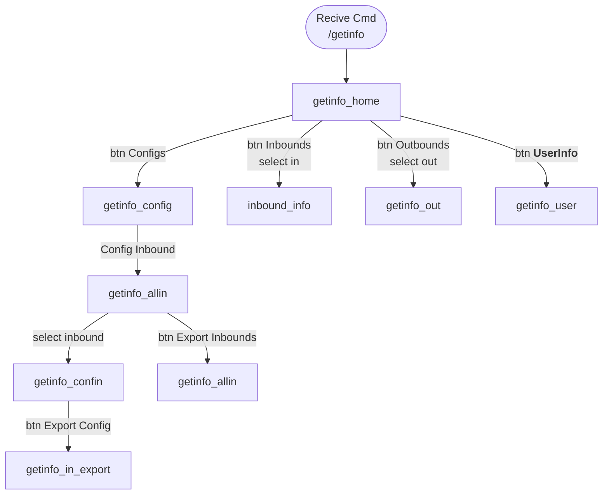
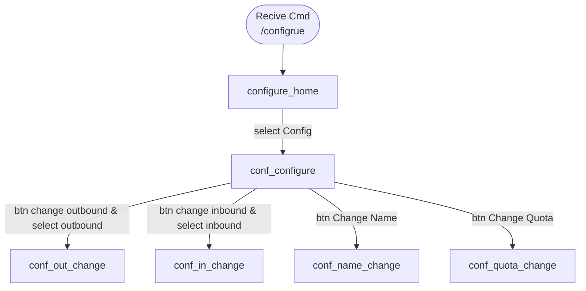

# Other

## Message Template Structure for commands

### CMD getinfo

```mermaid
flowchart TD
    A([Recive Cmd<br>/getinfo]) --> B[getinfo_home]

    B -->|btn Configs| C[getinfo_config]
    B -->|btn Inbounds<br>select in| D[inbound_info]
    B -->|btn Outbounds<br>select out| E[getinfo_out]
    B --> |btn <b>UserInfo</b>| F[getinfo_user]

    C -->|Config Inbound| G[getinfo_allin]
    G -->|select inbound| H[getinfo_confin]
    H -->|btn Export Config| I[getinfo_in_export]
    G -->|btn Export Inbounds| G2[getinfo_allin]

    click B "../other_config/templates/varibles/#getinfo_home"
    click C "../other_config/templates/varibles/#getinfo_config"
    click D "../other_config/templates/varibles/#inbound_info"
    click E "../other_config/templates/varibles/#getinfo_out"
    click F "../other_config/templates/varibles/#getinfo_user"
    click G "../other_config/templates/varibles/#getinfo_allin"
    click G2 "../other_config/templates/varibles/#getinfo_allin"
    click H "../other_config/templates/varibles/#getinfo_confin"
    click I "../other_config/templates/varibles/#getinfo_in_export"
```

### CMD configure

```mermaid
flowchart TD
    A([Recive Cmd<br>/configrue]) --> B[configure_home]

    B -->|select Config| C[conf_configure]
    C -->|btn change outbound & select outbound| D[conf_out_change]
    C -->|btn change inbound & select inbound| E[conf_in_change]
    C --> |btn Change Name| F[conf_name_change]
    C -->|btn Change Quota| G[conf_quota_change]
```
